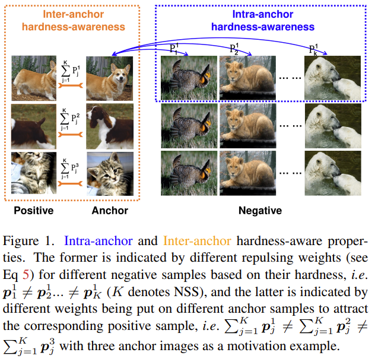

# Dual Temperature Helps Contrastive Learning Without Many Negative Samples: Towards Understanding and Simplifying MoCo (Accepted by CVPR2022)


Chaoning Zhang, Kang Zhang, Trung X. Pham, Axi Niu, Zhinan Qiao, Chang D. Yoo, In So Kweon

Contrastive learning (CL) is widely known to require many negative samples, 65536 in MoCo for instance, for which the performance of a dictionary-free framework is often inferior because the negative sample size (NSS) is limited by its mini-batch size (MBS). To decouple the NSS from the MBS, a dynamic dictionary has been adopted in a large volume of CL frameworks, among which arguably the most popular one is MoCo family. In essence, MoCo adopts a momentum-based queue dictionary, for which we perform a fine-grained analysis of its size and consistency. We point out that InfoNCE loss used in MoCo implicitly attract anchors to their corresponding positive sample with various strength of penalties and identify such inter-anchor hardness-awareness property as a major reason for the necessity of a large dictionary. Our findings motivate us to simplify MoCo v2 via the removal of its dictionary as well as momentum. Based on an InfoNCE with the proposed dual temperature, our simplified frameworks, SimMoCo and SimCo, outperform MoCo v2 by a visible margin. Moreover, our work bridges the gap between CL and non-CL frameworks, contributing to a more unified understanding of these two mainstream frameworks in SSL.


This repository is the official implementation of ["Dual Temperature Helps Contrastive Learning Without Many Negative Samples: Towards Understanding and Simplifying MoCo"](https://arxiv.org/abs/2203.17248).




---
See also our other works:

Decoupled Adversarial Contrastive Learning for Self-supervised Adversarial Robustness (Accepted by ECCV2022 oral presentation) [code](https://github.com/pantheon5100/DeACL.git) [paper](https://arxiv.org/abs/2207.10899)

---

# Dual Temperature
You can simply replace your original loss with dual-temperature loss from the following code:
```python
# q1 is the anchor and k2 is the positive sample
# The intra-anchor hardness-awareness is controlled by `temperature` parameter.
nce_loss = dual_temperature_loss_func(q1, k2,
                                temperature=temperature,
                                dt_m=dt_m)

def dual_temperature_loss_func(
    query: torch.Tensor,
    key: torch.Tensor, 
    temperature=0.1,
    dt_m=10,
) -> torch.Tensor:

    """
    query: anchor sample.
    key: positive sample.
    temperature: intra-anchor hardness-awareness control temperature.
    dt_m: the scalar number to get inter-anchor hardness awareness temperature.
          inter-anchor hardness awareness temperature is calculated by dt_m * temperature
    """

    # intra-anchor hardness-awareness
    b = query.size(0)
    pos = torch.einsum("nc,nc->n", [query, key]).unsqueeze(-1)

    # Selecte the intra negative samples according the updata time, 
    neg = torch.einsum("nc,ck->nk", [query, key.T])
    mask_neg = torch.ones_like(neg, dtype=bool)
    mask_neg.fill_diagonal_(False)
    neg = neg[mask_neg].reshape(neg.size(0), neg.size(1)-1)
    logits = torch.cat([pos, neg], dim=1)
    
    logits_intra = logits / temperature
    prob_intra = F.softmax(logits_intra, dim=1)

    # inter-anchor hardness-awareness
    logits_inter = logits / (temperature*dt_m)
    prob_inter = F.softmax(logits_inter, dim=1)

    # hardness-awareness factor
    inter_intra = (1 - prob_inter[:, 0]) / (1 - prob_intra[:, 0])

    loss = -torch.nn.functional.log_softmax(logits_intra, dim=-1)[:, 0]

    # final loss
    loss = inter_intra.detach() * loss
    loss = loss.mean()

    return loss

```

# 🔧 Enviroment

Please refer [solo-learn](https://github.com/vturrisi/solo-learn) to install the enviroment.

> First clone the repo.
> 
> Then, to install solo-learn with Dali and/or UMAP support, use:
> 
> `pip3 install .[dali,umap,h5] --extra-index-url https://developer.download.nvidia.com/compute/redist`


# Dataset
CIFAR10 and CIFAR100 will be automately downloaded.

# ⚡ Training
To train SimCo, SimMoCo, and MoCoV2, use the script in folder `./bash_files`. 

You should change the entity and project name to enable the wandb logging. `--project <YOUR_WANDB_PROJECT> --entity <YOUR_WANDB_ENTITY>`. Or you can simply remove `--wandb` to disable wandb logging.

# Results

| Batch size | 64    | 128   | 256            | 512   | 1024  |
|------------|-------|-------|----------------|-------|-------|
| MoCo v2    | 52.58 | 54.40 | 53.28          | 51.47 | 48.90 |
| SimMoCo    | 54.02 | 54.93 | 54.11          | 52.45 | 49.70 |
| SimCo      | 58.04 | 58.29 | **58.35** | 57.08 | 55.34 |

More result can be found in the paper.

This code is developed based on [solo-learn](https://github.com/vturrisi/solo-learn).

# Citation
```
@article{zhang2022dual,
  title={Dual temperature helps contrastive learning without many negative samples: Towards understanding and simplifying moco},
  author={Zhang, Chaoning and Zhang, Kang and Pham, Trung X and Niu, Axi and Qiao, Zhinan and Yoo, Chang D and Kweon, In So},
  journal={CVPR},
  year={2022}
}
```


# Acknowledgement

This work was partly supported by Institute for Information & communications Technology Planning & Evaluation (IITP) grant funded by the Korea government (MSIT) under grant No.2019-0-01396 (Development of framework for analyzing, detecting, mitigating of bias in AI model and training data), No.2021-0-01381 (Development of Causal AI through Video Understanding and Reinforcement Learning, and Its Applications to Real Environments) and No.2021-0-02068 (Artificial Intelligence Innovation Hub).
